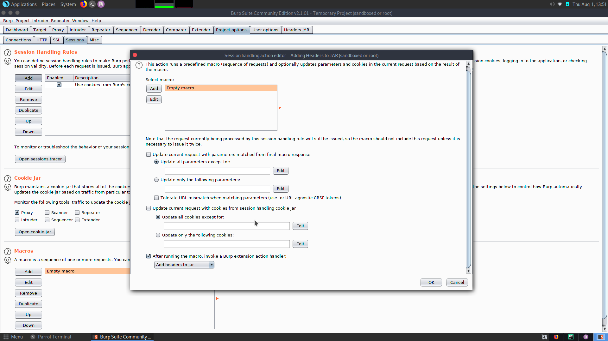

# BurpPlugins
It's a repo for BurpSuite plugins.

# List of plugins:
1. Headers JAR - Plugin for automatical updates of Bearer. 
2. REST API Target - Plugin for showing API request in Target tab.
3. Cookie Jar Cleaner - Plugin for cleaning of Cookie Jar. 
4. AuthChecker - Simple plugin for automatical searching of Broken Authentication.

# Headers JAR
Plugin for updating headers automatically, e.g. to update Bearer after the expiration of the old one.
It contains two SessionHandlingAction:
- UpdateHeaders *(update headers from JAR)*
- AddHeaders *(add new headers to JAR)*

Also plugin provides Tab with confuguration and logs panels.

## Usage
* Create Session Handling Rules in tab *Project Options/Sessions*:
  - One rule for catching new headers and adding them into Headers JAR(e.g. catch new Header from Proxy-Browser).
    
    
    
  - Second rule for updating headers, you can configure rule to update all headers or update only when the header has expired.
    
    
    
* Open Tab *Headers JAR* and add name the header.

    

