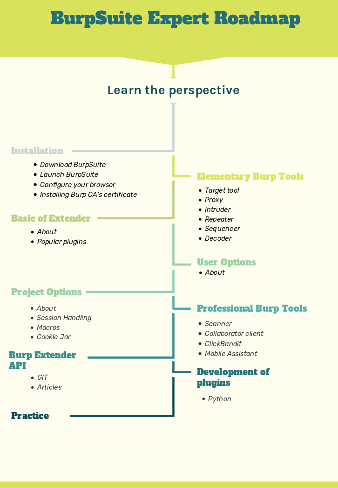

# Burp RoadMap From Beginner to Expert

## Install tutorial:
- [Download BurpSuite](https://support.portswigger.net/customer/en/portal/articles/2327557-downloading-burp-software-and-your-license-key)
- [Launch BurpSuite](https://support.portswigger.net/customer/portal/articles/1783038-Installing_Launching%20Burp.html)
- [Configure Browser](https://support.portswigger.net/customer/portal/articles/1783055-configuring-your-browser-to-work-with-burp)
- [Installing Burp's CA Certificate in your browser](https://support.portswigger.net/customer/portal/articles/1783075-installing-burp-s-ca-certificate-in-your-browser) 

## Elementary Burp Tools
### Tools
- [Target tool](https://portswigger.net/burp/documentation/desktop/tools/target)
- [Proxy](https://portswigger.net/burp/documentation/desktop/tools/proxy)
- [Intruder](https://portswigger.net/burp/documentation/desktop/tools/intruder)
- [Repeater](https://portswigger.net/burp/documentation/desktop/tools/repeater)
- [Sequencer](https://portswigger.net/burp/documentation/desktop/tools/sequencer)
- [Decoder](https://portswigger.net/burp/documentation/desktop/tools/decoder)
### Articles
- [In Russian](https://losst.ru/kak-polzovatsya-burp-suite#2_1048108910871086108311001079108610741072108510801077nbspIntruder)
___

## Basic of Burp Extender
- [About](https://portswigger.net/burp/documentation/desktop/tools/extender)
- [BApp Store](https://portswigger.net/bappstore)
- Popular plugins:
    + https://github.com/Hack-with-Github/Powerful-Plugins/blob/master/Burp.md
    + https://github.com/AdrianCitu/burp-tabnabbing-extension
    +

## User Options
- [About](https://portswigger.net/burp/documentation/desktop/options)

## Session Options
- [About](https://portswigger.net/burp/documentation/desktop/options)
- [Session handling Support](https://support.portswigger.net/customer/portal/articles/2363088-configuring-burp-s-session-handling-rules)
- [Session handling](https://resources.infosecinstitute.com/burps-session-handling-mechanisms/)
- [Session Handling Mechanism](https://resources.infosecinstitute.com/burps-session-handling-mechanisms/)
- [Macros](https://digi.ninja/blog/burp_macros.php)
- [Example of using Macros](https://bestestredteam.com/2019/05/25/bypassing-csrf-with-burp-suite/)
- [Cookie Jar]()

## Professional Burp Tools
### Tools
- [Scanner](https://portswigger.net/burp/documentation/scanner)
- [Collaborator](https://portswigger.net/burp/documentation/desktop/tools/collaborator-client)
- [Clickbandit](https://portswigger.net/burp/documentation/desktop/tools/clickbandit)
- [Mobile Assistant](https://portswigger.net/burp/documentation/desktop/tools/mobile-assistant)
### Articles
- [Collaborator in Amazon AWS](https://www.nuharborsecurity.com/creating-a-private-burp-collaborator-in-amazon-aws-with-a-letsencrypt-wildcard-certificate/)
- [Usage of ClickBandit](https://www.hackingarticles.in/advance-web-application-testing-using-burpsuite/)
- [!]()
___

## Burp Extender API
- [Git](https://github.com/PortSwigger/burp-extender-api)
- [PortSwigger](https://portswigger.net/burp/extender/)
- [How to Automate Burp](http://blog.dornea.nu/2013/08/02/howto-automate-burp-using-burp-extender-api/)

## Development of plugins on Python
- [Tutorial](https://laconicwolf.com/2018/04/13/burp-extension-python-tutorial)
- [Example](https://laconicwolf.com/2019/02/07/burp-extension-python-tutorial-encode-decode-hash/)

## Rest
- ### Tutorials
    + [Tutorial 1](https://www.pentestgeek.com/web-applications/burp-suite-tutorial-1)
    + [Cycle of notes](https://jaimelightfoot.com/blog/burp-suite-for-beginners-setup-and-target-proxy-tools/)
    + [Tutorial in Russian](https://habr.com/en/post/328382/)
    + [Tutorial 2](https://codegrazer.com/tutorial/burp-tutorial-beginner.html)
-    https://habr.com/en/post/328382/
-    https://losst.ru/kak-polzovatsya-burp-suite#2_1048108910871086108311001079108610741072108510801077nbspIntruder